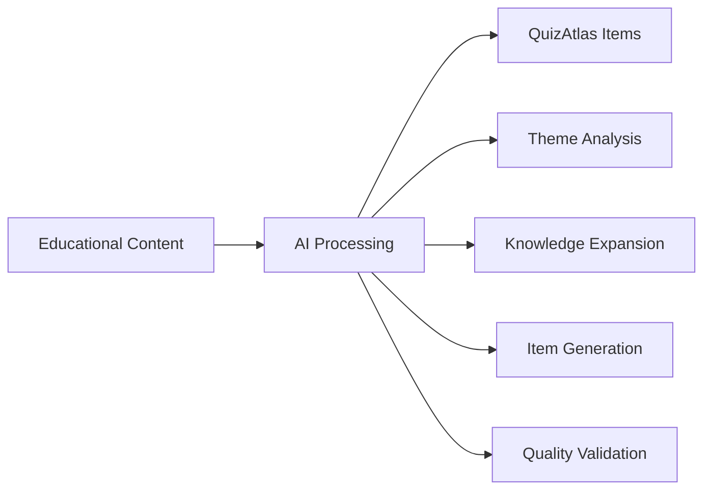

# QuizAtlas Workflow Overview

**⚠️ High-level conceptual overview only - implementation details are proprietary**

## Workflow Diagram

## Process Summary

The QuizAtlas generation system transforms educational content into structured assessment items through an AI-powered pipeline that:

1. **Analyzes** source materials to extract key concepts
2. **Expands** content with additional context and verification
3. **Generates** items with appropriate difficulty and cognitive levels
4. **Validates** output for format compliance and quality standards

## What's NOT Included

- ❌ Actual prompts or model configurations
- ❌ Automation scripts or implementation code
- ❌ Proprietary algorithms or scoring methods
- ❌ Production quality assurance processes
- ❌ Real assessment content or test items

## Partnership Required

For access to complete implementation including:
- Full workflow specifications
- Production-ready prompts and models
- Quality assurance systems
- Integration support

Contact through official channels for partnership discussions.